# Trendora — Consumer Flow Diagram

This flowchart illustrates the step-by-step decision process a content creator (the consumer) follows when interacting with Trendora to strategize and generate content.

```mermaid
flowchart TD
    %% Custom styling based on the reference image
    classDef startNode fill:#ffaa00,stroke:#e69900,stroke-width:1px,color:#000,font-weight:bold,rx:5px,ry:5px
    classDef actionNode fill:#4b8cfb,stroke:#3a7be0,stroke-width:1px,color:#fff
    classDef decisionNode fill:#a279e6,stroke:#8f65d1,stroke-width:1px,color:#fff
    classDef endNode fill:#ff99aa,stroke:#e68193,stroke-width:1px,color:#000,rx:5px,ry:5px

    START([START]):::startNode
    
    LOGIN[Log in to Platform]:::actionNode
    START --> LOGIN
    
    NICHE[Select Content Niche]:::actionNode
    LOGIN --> NICHE
    
    FETCH_TRENDS[Fetch Trending Topics]:::actionNode
    NICHE --> FETCH_TRENDS
    
    GAP{Run Gap<br/>Analysis?}:::decisionNode
    FETCH_TRENDS --> GAP
    
    INPUT_COMP[Input Competitor URL]:::actionNode
    GAP -->|Yes| INPUT_COMP
    
    IS_GAP{High<br/>Opportunity?}:::decisionNode
    INPUT_COMP --> IS_GAP
    
    IS_GAP -->|No| FETCH_TRENDS
    
    PRED{Check ML<br/>Forecast?}:::decisionNode
    GAP -->|No| PRED
    IS_GAP -->|Yes| PRED
    
    RUN_PRED[Run Trend Prediction]:::actionNode
    PRED -->|Yes| RUN_PRED
    
    IS_GROWTH{Trend<br/>Growing?}:::decisionNode
    RUN_PRED --> IS_GROWTH
    
    IS_GROWTH -->|No| FETCH_TRENDS
    
    GENERATE[Generate AI Script]:::actionNode
    IS_GROWTH -->|Yes| GENERATE
    PRED -->|No| GENERATE
    
    STYLE{Use Custom<br/>Style?}:::decisionNode
    GENERATE --> STYLE
    
    HAS_PROFILE{Profile<br/>Trained?}:::decisionNode
    STYLE -->|Yes| HAS_PROFILE
    
    TRAIN_STYLE[Train Style Engine]:::actionNode
    HAS_PROFILE -->|No| TRAIN_STYLE
    
    PERS_SCRIPT[Apply Style Profile]:::actionNode
    TRAIN_STYLE --> PERS_SCRIPT
    HAS_PROFILE -->|Yes| PERS_SCRIPT
    
    GEN_GENERIC[Generate Generic Script]:::actionNode
    STYLE -->|No| GEN_GENERIC
    
    CALENDAR{Schedule<br/>Post?}:::decisionNode
    PERS_SCRIPT --> CALENDAR
    GEN_GENERIC --> CALENDAR
    
    SAVE_POST[Save to Content Calendar]:::actionNode
    CALENDAR -->|Yes| SAVE_POST
    
    END([Content Strategy Complete]):::endNode
    SAVE_POST --> END
    CALENDAR -->|No| END
```

## Flow Breakdown

1. **Discovery & Validation**: The user starts by fetching trends. They use Gap Analysis and ML Predictions (decision diamonds) to validate if a trend is worth pursuing. 
2. **Infinite Loop Prevention**: If a trend is highly competitive or predicted to decline, the flow loops back to fetching new trends (the ❌ No paths on validation).
3. **Execution**: Once a winning trend is found, they proceed down the generation path, making decisions about tone (Custom Style vs Generic) and output destination (Save to Calendar).
