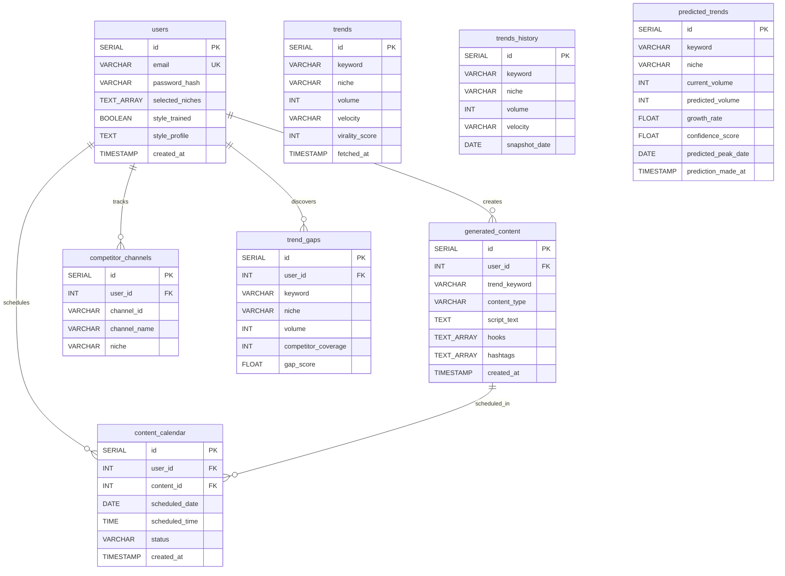

# Trendora — Database Schema

## Entity Relationship Diagram

## Table Details

### Core Tables

| Table | Purpose | Row Growth |
|-------|---------|------------|
| `users` | User accounts and style profiles | Slow (per registration) |
| `trends` | Cached trending topics with virality scores | Medium (per niche fetch) |
| `generated_content` | AI-generated scripts, hooks, hashtags | Medium (per generation) |
| `content_calendar` | Scheduled content items | Medium (per save) |

### Analytics Tables

| Table | Purpose | Row Growth |
|-------|---------|------------|
| `trends_history` | Daily trend snapshots for ML training | Fast (daily cron × keywords) |
| `predicted_trends` | ML-generated forecasts | Fast (daily cron × keywords) |
| `competitor_channels` | Tracked YouTube channels | Slow (per add) |
| `trend_gaps` | Gap analysis results | Medium (per analysis run) |

## Unique Constraints

| Table | Unique Constraint |
|-------|-------------------|
| `users` | `email` |
| `trends` | `(keyword, niche, fetched_at)` |
| `trends_history` | `(keyword, niche, snapshot_date)` |
| `predicted_trends` | `(keyword, niche, prediction_made_at)` |

## Foreign Key Relationships

| Child Table | Column | References |
|-------------|--------|------------|
| `generated_content` | `user_id` | `users.id` |
| `content_calendar` | `user_id` | `users.id` |
| `content_calendar` | `content_id` | `generated_content.id` |
| `competitor_channels` | `user_id` | `users.id` |
| `trend_gaps` | `user_id` | `users.id` |
