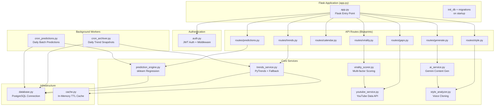
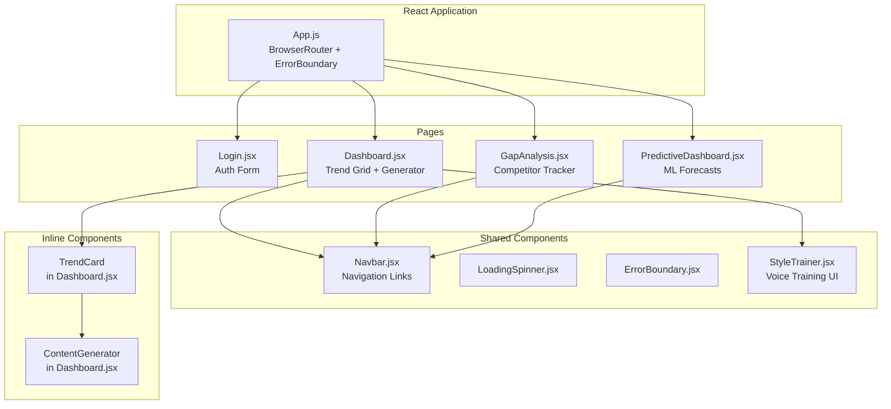

# Trendora — Low-Level Design (LLD)

## Backend Module Architecture

## Frontend Component Hierarchy

## Key Design Decisions

| Decision | Choice | Rationale |
|----------|--------|-----------|
| **API Framework** | Flask + Blueprints | Lightweight, modular route organization |
| **Auth** | JWT (PyJWT) | Stateless, fits React SPA pattern |
| **AI Model** | Gemini 2.0 Flash | Fast, cost-effective, good JSON output |
| **ML Model** | sklearn LinearRegression | Simple, interpretable, fast inference |
| **Database** | PostgreSQL | Reliable, supports arrays, good Render integration |
| **Caching** | In-memory dict | Simple for MVP (Redis recommended for scale) |
| **Frontend State** | React useState/useEffect | Lightweight, no state library needed yet |
