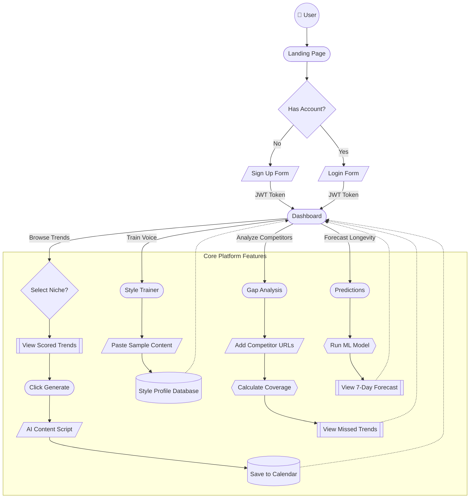

# Trendora — User Flow Diagram

This diagram visualizes the end-to-end journey of a user interacting with the Trendora platform, using distinct shapes to represent different elements (User = Circle, UI/Pages = Rounded Boxes, Actions/Inputs = Parallelograms, Decisions = Diamonds, Databases/Storage = Cylinders).

## Key User Journeys

### 1. The Content Creator Flow
1. User logs in and lands on the **Dashboard**.
2. Selects their niche (e.g., "Tech").
3. Browses the top virality-scored trends.
4. Clicks "Generate Content" on a promising trend.
5. Gets an AI-generated script, hooks, and hashtags for a YouTube Short/TikTok.
6. Saves the item to their Content Calendar.

### 2. The Voice Cloning Flow
1. User navigates to the **Style Trainer**.
2. Pastes examples of their past successful posts or scripts.
3. Trendora analyzes and saves a unique "Style Profile" (tone, pacing, vocabulary).
4. From now on, any generated content uses their personalized voice.

### 3. The Strategist Flow
1. User goes to **Gap Analysis**.
2. Enters their top competitors' YouTube channel URLs.
3. Trendora cross-references trending topics with competitor videos.
4. User finds "High Opportunity" gaps (topics their competitors haven't covered yet).
5. User navigates to **Predictions** to see if that topic will continue growing over the next 7 days before filming.
